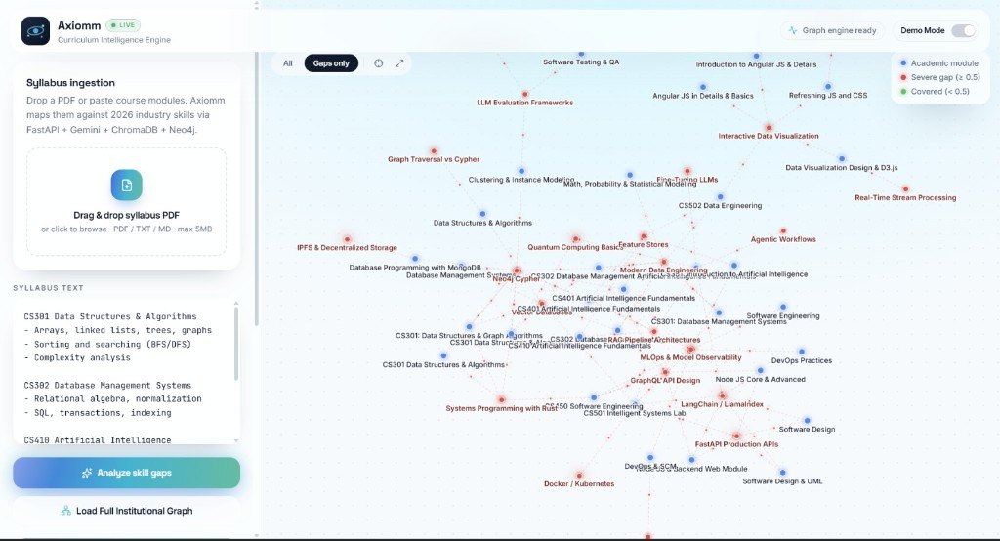
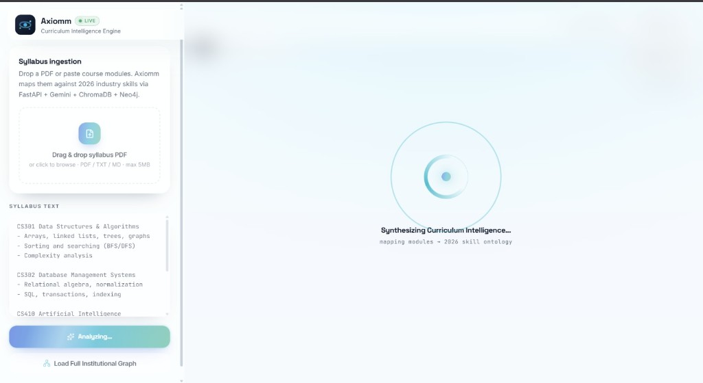
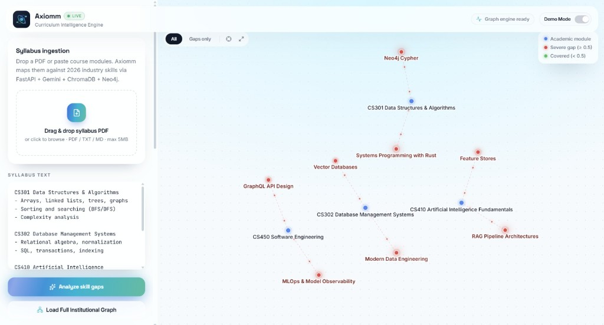
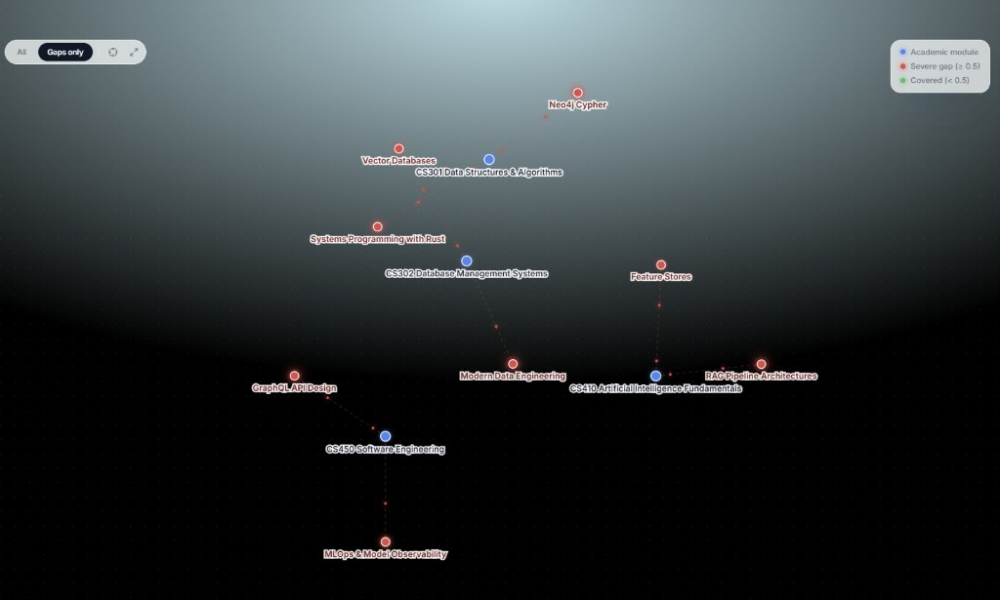
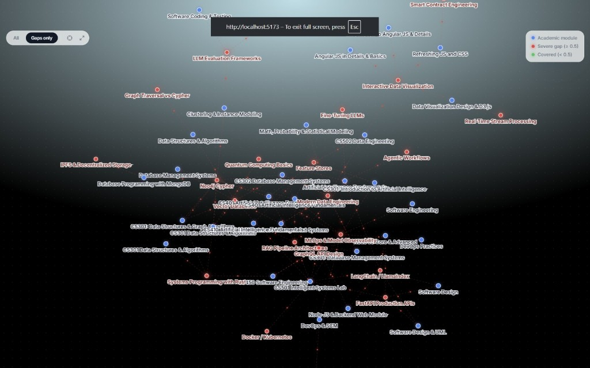
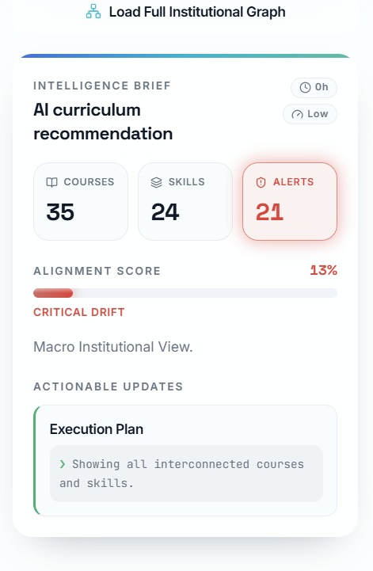

# 🎓 Axiomm — Dynamic Syllabus & Industry Skill-Gap Synchronizer

[](https://github.com/Parth5002/TETRA034)
[](https://nuv.ac.in)
[]()
[]()
[]()
[]()

> **Official Indo-French AI Hackathon Submission**  
> **Organizers:** Navrachana University (Vadodara) & ISEN Méditerranée (France)  
> **Powered by:** India AI Mission | **Incubation Partner:** Navrachana Innovation Foundation (NIF)

---

## 🖼️ Product Screenshots

<p align="center">
  
  <br/>
  <em>Live curriculum analysis — academic modules (blue) linked to industry skill gaps (red)</em>
</p>

| Analyzing syllabus | Force-graph dashboard |
| :---: | :---: |
|  |  |

| Gaps-only focus view | Institutional macro graph |
| :---: | :---: |
|  |  |

<p align="center">
  
  <br/>
  <em>Intelligence Brief — alignment score, Courses / Skills / Alerts, and Execution Plan</em>
</p>

---

## 📌 Executive Summary

Higher education computer science curricula lag **3 to 5 years** behind market demands. Academic institutions lack automated, data-driven tools to audit syllabus content against real-time industry requirements. As a result, students graduate with high grades but face severe skill gaps in modern paradigms such as **RAG architectures, vector databases, agentic workflows, Neo4j graph querying, and MLOps observability**.

**Axiomm** solves this problem. It acts as an automated curriculum auditor for university deans and department chairs, instantly ingesting syllabus documents (PDF/Text), querying vector stores of live 2026 industry skill embeddings, generating structured gap graphs via Google Gemini 3.5 Flash, storing persistent skill ontologies in Neo4j AuraDB, and rendering an interactive force-graph with concrete, actionable curriculum updates.

---

## 🌟 Key Differentiators & Why Axiomm Leads

1. **Dual DB Hybrid Architecture (Vector + Knowledge Graph):** Combines **ChromaDB** (for high-speed semantic retrieval against pre-seeded 2026 skill embeddings) with **Neo4j AuraDB** (for persistent, explainable graph relationship modeling between academic modules and industry skills).
2. **Zero-Crash Resiliency Protocol:** Built with an enterprise-grade fail-safe architecture. Every external service call (Gemini, Neo4j, ChromaDB) is guarded with multi-tier error catching and instant fallback handlers (`fallback_data.py`), guaranteeing **zero HTTP 500 errors** during live evaluation pitches.
3. **Native PDF & Text Parsing Pipeline:** Integrates `pypdf` server-side streaming to extract structured text directly from raw university syllabus PDFs or pasted course outlines.
4. **Interactive Graph Visualizer:** Canvas force-graph with glow effects, Gaps-only filtering, hover spotlighting, and institutional macro-graph loading for jury demos.

---

## 🏗️ System Architecture

```
┌─────────────────────────────────────────┐
│     University Dean / Department Chair  │
└────────────────────┬────────────────────┘
│ Upload PDF / Paste Text
▼
┌─────────────────────────────────────────┐
│   React 19 + TanStack Start Frontend    │
│     (Axiomm UI + Force Graph Canvas)    │
└────────────────────┬────────────────────┘
│ Multipart HTTP Request (:8000)
▼
┌─────────────────────────────────────────┐
│      FastAPI Engine (Python 3.11)       │
│       Strict Pydantic v2 Schemas        │
└─────────┬──────────┬──────────┬─────────┘
│          │          │
┌─────────────────────┘          │          └─────────────────────┐
▼                                ▼                                ▼
┌──────────────────────┐        ┌──────────────────────┐        ┌──────────────────────┐
│  ChromaDB (Vector)   │        │ Google Gemini Flash  │        │ Neo4j AuraDB (Graph) │
│ Semantic Search vs.  │        │ Structured JSON Gap  │        │ Persistent Course ↔  │
│ 30 2026 Industry     │        │ Analysis & Actionable│        │ Skill Ontology       │
│ Skill Embeddings     │        │ Curriculum Rewrites  │        │ Cypher Relationships │
└──────────┬───────────┘        └──────────┬───────────┘        └──────────┬───────────┘
│                               │                               │
└───────────────────────────────┼───────────────────────────────┘
▼
┌─────────────────────────────────────────┐
│           AnalysisResponse JSON         │
│ (Blue: Academic | Red: Gap | Green: Cover)│
└─────────────────────────────────────────┘
```

---

## 📊 The Interactive Graph Contract

| Node Type | Color Code | Description / Logic |
| :--- | :--- | :--- |
| **Academic Module** | 🔵 **Blue (`#3b82f6`)** | Existing university course subjects (e.g., DSA, DBMS, Software Engineering). |
| **Severe Skill Gap** | 🔴 **Red (`#ef4444`)** | Critical 2026 industry skills missing or under-taught (`gap_score ≥ 0.5`). |
| **Covered Skill** | 🟢 **Green (`#10b981`)** | Industry skills adequately addressed in the current syllabus (`gap_score < 0.5`). |

---

## 🛠️ Complete Tech Stack

| Layer | Technology | Function & Purpose |
| :--- | :--- | :--- |
| **Frontend Framework** | **React 19 + TanStack Start + Vite** | Enterprise Axiomm dashboard on port 5173, wired to FastAPI. |
| **UI Aesthetics** | **Tailwind CSS v4 + shadcn primitives** | Glass panels, cyan–teal brand accents, motion polish. |
| **Visualization** | **Custom canvas force-graph** | Gap glow, Gaps-only filter, hover dimming, recenter / fullscreen. |
| **Icons & Transport** | **`lucide-react` + `fetch`** | UI icons & multipart HTTP client for `/api/analyze`. |
| **Backend Engine** | **FastAPI + Uvicorn** | Asynchronous Python API with OpenAPI docs (`/docs`). |
| **Data Schemas** | **Pydantic v2** | Strict `Node`, `Link`, and `AIRecommendation` contracts. |
| **AI LLM Brain** | **Google Gemini 3.5 Flash** | Structured JSON generation via `google-genai` SDK. |
| **Vector Engine** | **ChromaDB** | Local persistent store with 30 canonical 2026 skill embeddings. |
| **Knowledge Graph** | **Neo4j AuraDB (Cloud)** | Course–Skill ontology with Cypher upserts + macro graph API. |
| **Document Ingestion** | **`pypdf`** | Server-side PDF extraction for multi-page syllabi. |

---

## ⚡ Zero-Crash Resiliency Protocol

In hackathon environments, live demos frequently fail due to API rate limits or network drops. Axiomm implements a strict **Zero-Crash Policy**:

1. **Multi-Model Fallback Chain:** If `gemini-3.5-flash` encounters quota limits, the backend cascades through candidate models.
2. **Deterministic Fallback Payload (`fallback_data.py`):** External failures return a validated mock analysis with `is_mock: true` — never an unhandled HTTP 500.
3. **SSL Interception Relaxation (`+ssc`):** Detects local proxy/antivirus TLS interception for Neo4j and switches to SSL-relaxed URIs.

---

## 🚀 Quickstart & Installation Guide

### Prerequisites
* **Python 3.11+**
* **Node.js 18+ & npm**
* **Google Gemini API Key** (Free tier via Google AI Studio)

### 1. Backend Setup

```bash
cd backend
python -m venv venv
# Windows: .\venv\Scripts\activate
source venv/bin/activate
pip install -r requirements.txt
cp .env.example .env
```

Edit `.env`:
```env
GEMINI_API_KEY=your_gemini_api_key_here
GEMINI_MODEL=gemini-3.5-flash
NEO4J_URI=neo4j+s://your-instance.databases.neo4j.io
NEO4J_USERNAME=neo4j
NEO4J_PASSWORD=your_neo4j_password
DEMO_MODE=False
```

```bash
uvicorn main:app --reload --port 8000
```

> API: http://localhost:8000 · Swagger: http://localhost:8000/docs

### 2. Frontend Setup

```bash
cd frontend
npm install
npm run dev
```

> UI: http://localhost:5173

---

## 📡 API Reference

| Endpoint | Method | Input | Description |
|---|---|---|---|
| `/health` | GET | None | Liveness probe |
| `/api/mock-analyze` | GET | None | Instant Demo Mode payload |
| `/api/macro-graph` | GET | None | Full institutional Neo4j graph |
| `/api/analyze` | POST | multipart (`syllabus_text`, `file`) | Primary analysis pipeline |
| `/api/analyze/json` | POST | JSON (`syllabus_text`) | REST JSON variant |

---

## 👥 Team TETRA034

* **Parth Gohil** — Backend Architecture, Gemini Prompt Engineering & Neo4j Integration
* **Nisarg** — Frontend Engineering, Graph Visualizations & UX Design

## 📜 License & Acknowledgments

Built under **TetraTHON 2026** (Indo-French AI Hackathon) hosted at **Navrachana University, Vadodara** in collaboration with **ISEN Méditerranée, France**, powered by the **India AI Mission** and supported by **Navrachana Innovation Foundation (NIF)**.

*All rights reserved by Team TETRA034.*
